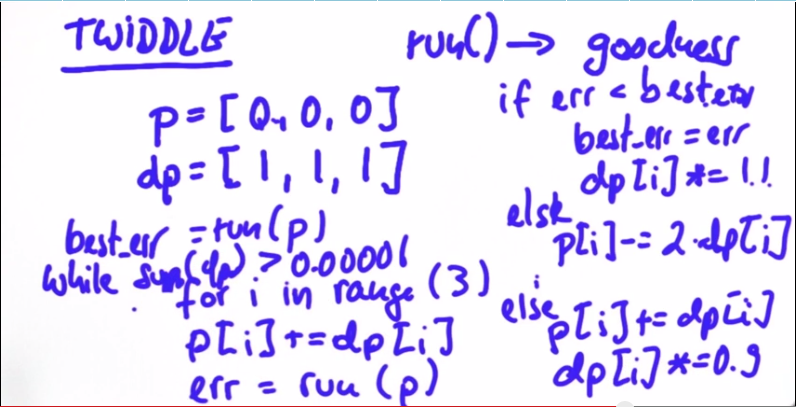

# CarND-Controls-PID
Self-Driving Car Engineer Nanodegree Program

---

## Dependencies

* cmake >= 3.5
 * All OSes: [click here for installation instructions](https://cmake.org/install/)
* make >= 4.1(mac, linux), 3.81(Windows)
  * Linux: make is installed by default on most Linux distros
  * Mac: [install Xcode command line tools to get make](https://developer.apple.com/xcode/features/)
  * Windows: [Click here for installation instructions](http://gnuwin32.sourceforge.net/packages/make.htm)
* gcc/g++ >= 5.4
  * Linux: gcc / g++ is installed by default on most Linux distros
  * Mac: same deal as make - [install Xcode command line tools]((https://developer.apple.com/xcode/features/)
  * Windows: recommend using [MinGW](http://www.mingw.org/)
* [uWebSockets](https://github.com/uWebSockets/uWebSockets)
  * Run either `./install-mac.sh` or `./install-ubuntu.sh`.
  * If you install from source, checkout to commit `e94b6e1`, i.e.
    ```
    git clone https://github.com/uWebSockets/uWebSockets 
    cd uWebSockets
    git checkout e94b6e1
    ```
    Some function signatures have changed in v0.14.x. See [this PR](https://github.com/udacity/CarND-MPC-Project/pull/3) for more details.
* Simulator. You can download these from the [project intro page](https://github.com/udacity/self-driving-car-sim/releases) in the classroom.

Fellow students have put together a guide to Windows set-up for the project [here](https://s3-us-west-1.amazonaws.com/udacity-selfdrivingcar/files/Kidnapped_Vehicle_Windows_Setup.pdf) if the environment you have set up for the Sensor Fusion projects does not work for this project. There's also an experimental patch for windows in this [PR](https://github.com/udacity/CarND-PID-Control-Project/pull/3).

## Basic Build Instructions

1. Clone this repo.
2. Make a build directory: `mkdir build && cd build`
3. Compile: `cmake .. && make`
4. Run it: `./pid`. 

Tips for setting up your environment can be found [here](https://classroom.udacity.com/nanodegrees/nd013/parts/40f38239-66b6-46ec-ae68-03afd8a601c8/modules/0949fca6-b379-42af-a919-ee50aa304e6a/lessons/f758c44c-5e40-4e01-93b5-1a82aa4e044f/concepts/23d376c7-0195-4276-bdf0-e02f1f3c665d)

## Result
Below is the result of the PID control. The car is able to go explore full track without any collision. The result can be found [here](media/result_car.m4v).

## Parameter Optimization
In this implementation, I use manual tuning for `Kp`, `Ki`, and `Kd`. It is a bit difficult to find a robust number due to difference contour of the road but eventually, I managed to get good numbers that allows the car to run in full lap without any collision.

### Manual Tuning
I started with using P controller with Kp = 0.15 because I was using this value for the previous project, which is behavioral cloning. Based on the classroom, I understand the difference between P, PD, and PID controller as shown in the image below.


Using P controller, the car started to occilate. Hence, I added an arbitrary number for Kd to implement PD controller. I choose Kd = 2.0. This constant is good to handle the car moving at top speed of 30 mph. It can handle a sharp turn and allow the car to do complete the track. However, PID controller is a common implementation since in the real world we might have steering shift. Based on this fact, I choose a very small value of Ki which is 5.0e-4. These configuration shows a good result which I think it is quite good to pass the project.


### Twiddle
Another solution to find out the optimal parameters is to use twiddle. Below is the pseudo code for twiddle and its implementation in Python from the classroom.
```python
def twiddle(tol=1e-10): 
    p = [0, 0, 0]
    dp = [1, 1, 1]
    robot = make_robot()
    x_trajectory, y_trajectory, best_err = run(robot, p)
    while best_err > tol:
        for i in range(3):
            p[i] += dp[i]
            robot = make_robot()
            x_trajectory, y_trajectory, err = run(robot, p)
            if err < best_err:
                best_err = err
                dp[i] *= 1.1
            else:
                p[i] -= 2*dp[i]
                robot = make_robot()
                x_trajectory, y_trajectory, err = run(robot, p)
                if err < best_err:
                    best_err = err
                    dp[i] *= 1.1
                else:
                    p[i] += dp[i]
                    dp[i] *= 0.9
    return p, best_err
  ```
  

## Other Improvement
The improvement can be done by controlling the speed of the car using another PID controller. This allows to car to be more stable when having a sharp turn.